# Diagrammes d'Architecture - A-Level Saver

Ce document contient les diagrammes Mermaid décrivant l'architecture et les flux du système A-Level Saver.

---

## 1. Vue d'Ensemble de l'Architecture

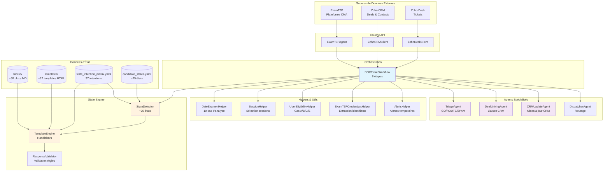

---

## 2. Workflow Principal - Traitement des Tickets DOC

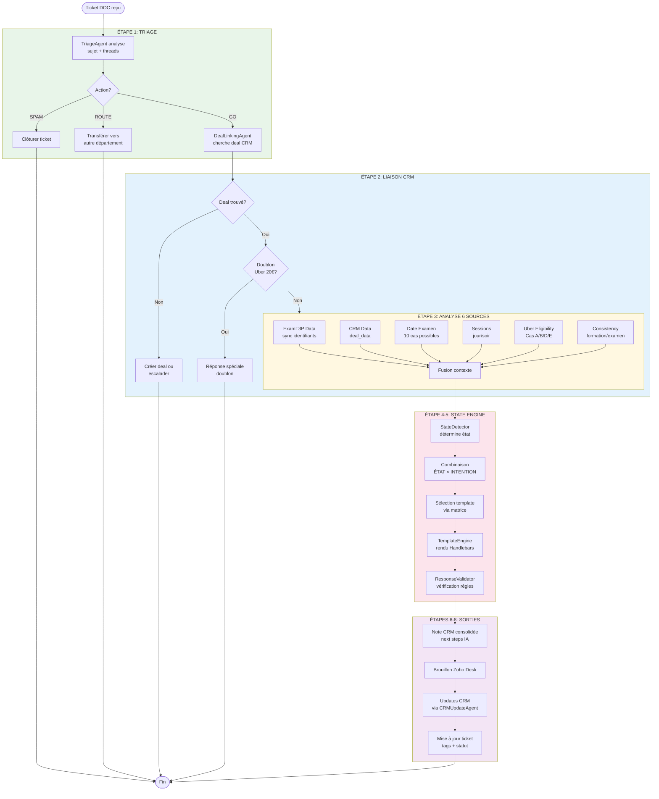

---

## 3. Machine à États - Détection d'État du Candidat

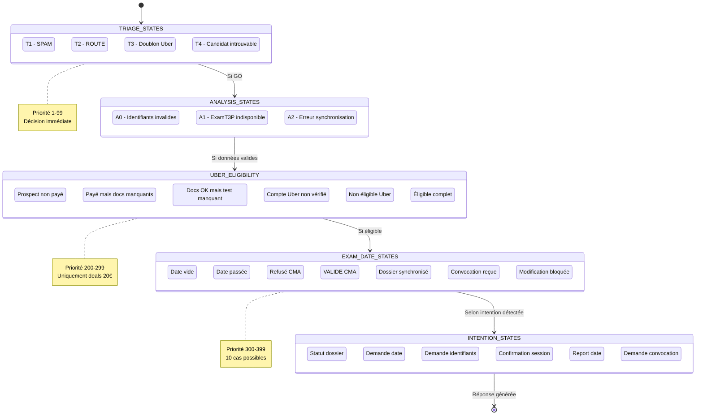

---

## 4. Flux de Données - De la Source au Template

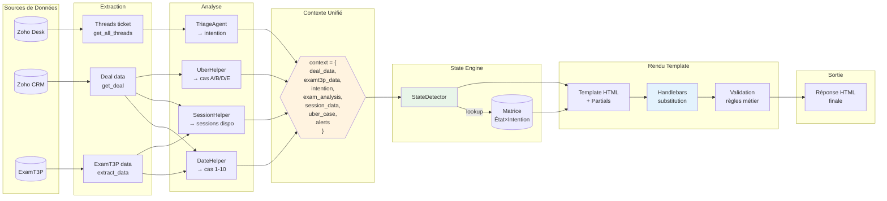

---

## 5. Cas Uber 20€ - Arbre de Décision

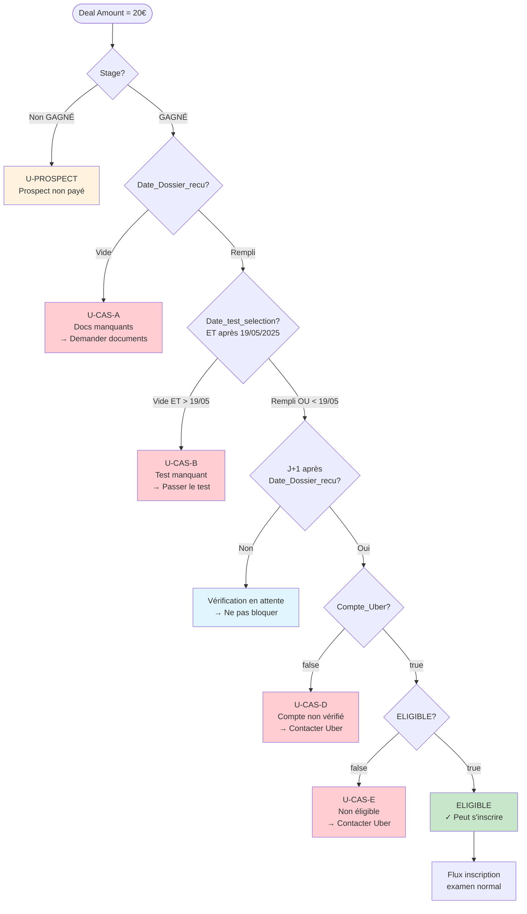

---

## 6. Agents et Leurs Responsabilités

```mermaid
graph TB
    subgraph "Agents IA (Claude)"
        TA[<b>TriageAgent</b><br/>━━━━━━━━━━━━<br/>• Classifie GO/ROUTE/SPAM<br/>• Détecte intention I01-I37<br/>• Extrait contexte urgence<br/>• Préférence session jour/soir]

        DLA[<b>DealLinkingAgent</b><br/>━━━━━━━━━━━━<br/>• Lie ticket → deal CRM<br/>• Détecte doublons Uber<br/>• Récupère deal_data<br/>• Gère cas multi-deals]

        CUA[<b>CRMUpdateAgent</b><br/>━━━━━━━━━━━━<br/>• Mapping string → ID<br/>• Règles de blocage<br/>• Updates sécurisés<br/>• Logging automatique]

        ETA[<b>ExamT3PAgent</b><br/>━━━━━━━━━━━━<br/>• Extraction données CMA<br/>• Statut dossier<br/>• Documents/paiements<br/>• Playwright backup]
    end

    subgraph "Helpers Fonctionnels"
        DEH[<b>DateExamenHelper</b><br/>━━━━━━━━━━━━<br/>• 10 cas de date<br/>• Dates alternatives<br/>• Filtrage par région<br/>• Règles de blocage]

        SH[<b>SessionHelper</b><br/>━━━━━━━━━━━━<br/>• Sessions jour/soir<br/>• Auto-sélection<br/>• Proposition options<br/>• Matching date→session]

        UEH[<b>UberEligibilityHelper</b><br/>━━━━━━━━━━━━<br/>• Cas A/B/D/E<br/>• Vérification timing<br/>• Messages adaptés<br/>• Règles de blocage]

        ECH[<b>CredentialsHelper</b><br/>━━━━━━━━━━━━<br/>• Extraction via IA<br/>• Validation connexion<br/>• Source CRM/threads<br/>• Gestion double compte]
    end

    TA --> |intention| WF[DOCTicketWorkflow]
    DLA --> |deal_data| WF
    CUA --> |updates| WF
    ETA --> |examt3p_data| WF

    DEH --> |exam_analysis| WF
    SH --> |session_data| WF
    UEH --> |uber_case| WF
    ECH --> |credentials| WF

    style TA fill:#e1bee7
    style DLA fill:#e1bee7
    style CUA fill:#e1bee7
    style ETA fill:#e1bee7
    style DEH fill:#b3e5fc
    style SH fill:#b3e5fc
    style UEH fill:#b3e5fc
    style ECH fill:#b3e5fc
    style WF fill:#c8e6c9
```

---

## 7. Template Engine - Sélection et Rendu

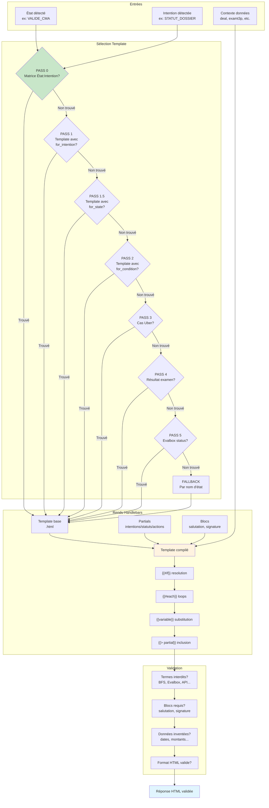

---

## 8. Synchronisation ExamT3P ↔ CRM

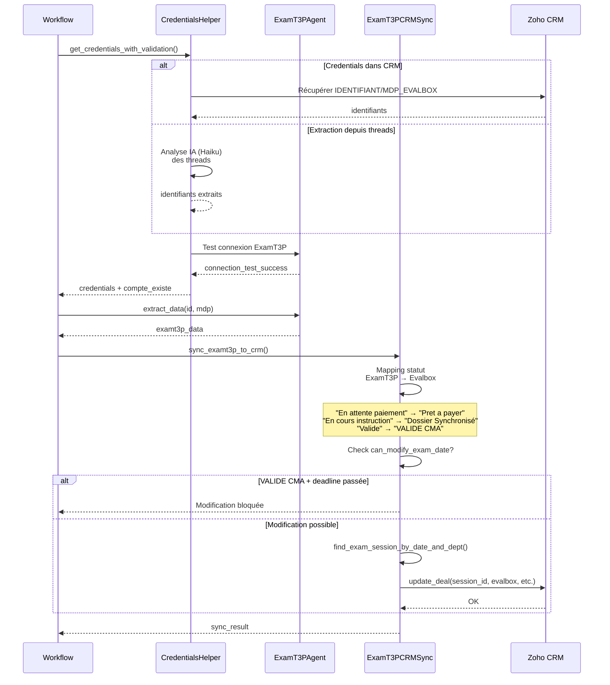

---

## 9. Architecture Modulaire des Templates

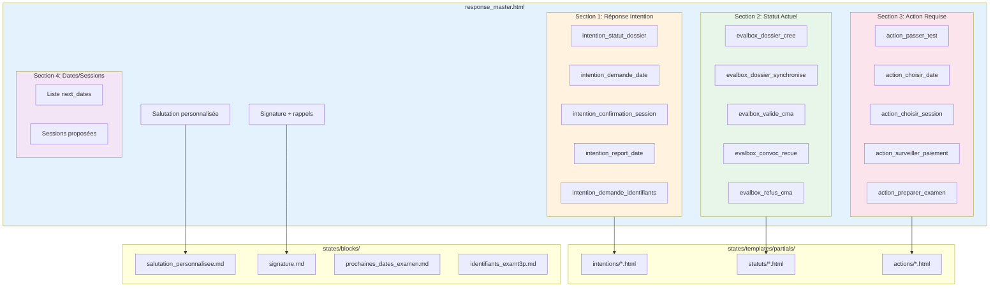

---

## 10. Cycle de Vie d'un Ticket DOC

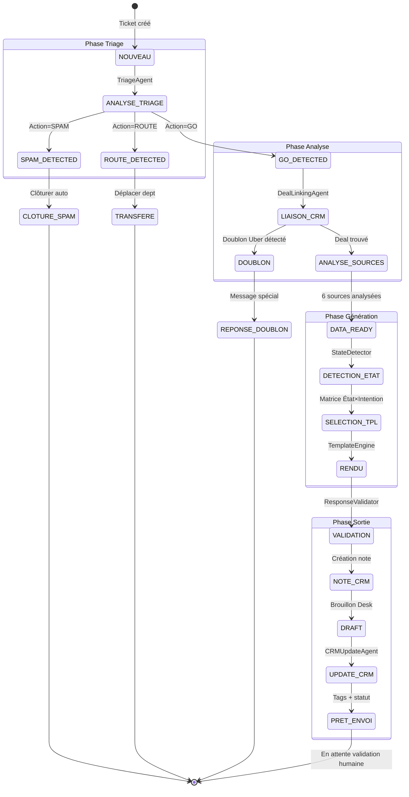

---

## 11. Intentions Détectées par TriageAgent (I01-I37)

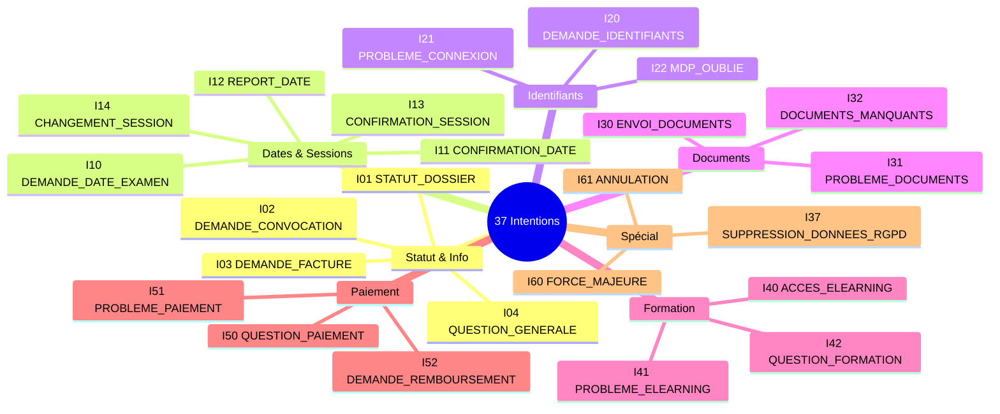

---

## 12. Règles de Blocage - Modification Date Examen

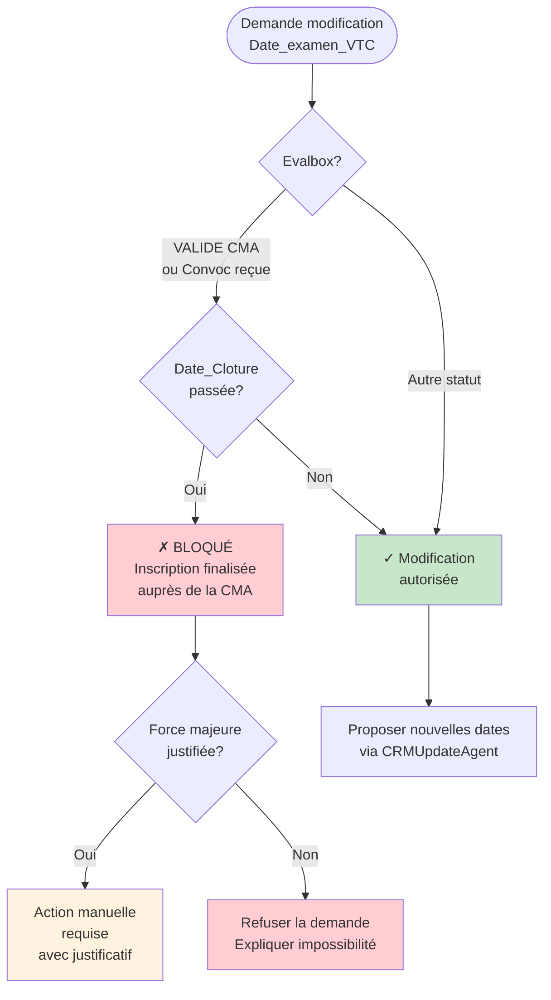

---

## 13. Stack Technologique

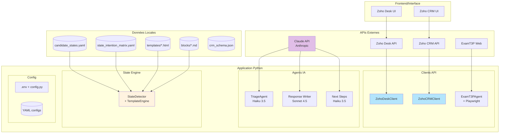

---

## Légende

| Couleur | Signification |
|---------|---------------|
| 🟢 Vert clair | Flux principal / OK |
| 🔵 Bleu clair | Données / APIs |
| 🟡 Jaune/Orange | Analyse / Traitement |
| 🟣 Violet | IA / Agents Claude |
| 🔴 Rouge clair | Blocage / Erreur |
| ⬜ Gris | Éléments neutres |

---

*Généré automatiquement depuis l'analyse du codebase A-Level Saver*
