# Diagrammes d'Architecture - A-Level Saver

Ce document contient les diagrammes Mermaid décrivant l'architecture et les flux du système A-Level Saver.

**Version 2.2** - Inclut l'architecture Multi-Intention et Multi-État, wildcards matrix, date_utils centralisé.

---

## 1. Vue d'Ensemble de l'Architecture

```mermaid
graph TB
    subgraph "Sources de Données Externes"
        ZD[Zoho Desk<br/>Tickets]
        ZC[Zoho CRM<br/>Deals & Contacts]
        ET[ExamT3P<br/>Plateforme CMA]
    end

    subgraph "Couche API"
        ZDC[ZohoDeskClient]
        ZCC[ZohoCRMClient]
        ETA[ExamT3PAgent]
    end

    subgraph "Agents Spécialisés"
        TA[TriageAgent<br/>GO/ROUTE/SPAM]
        DLA[DealLinkingAgent<br/>Liaison CRM]
        CUA[CRMUpdateAgent<br/>Mises à jour CRM]
        DA[DispatcherAgent<br/>Routage]
    end

    subgraph "Helpers & Utils"
        DEH[DateExamenHelper<br/>10 cas d'analyse]
        SH[SessionHelper<br/>Sélection sessions]
        UEH[UberEligibilityHelper<br/>Cas A/B/D/E]
        ECH[ExamT3PCredentialsHelper<br/>Extraction identifiants]
        AH[AlertsHelper<br/>Alertes temporaires]
        DU[DateUtils<br/>Parsing dates centralisé]
    end

    subgraph "State Engine"
        SD[StateDetector<br/>~25 états]
        TE[TemplateEngine<br/>Handlebars]
        RV[ResponseValidator<br/>Validation règles]
    end

    subgraph "Orchestration"
        WF[DOCTicketWorkflow<br/>8 étapes]
    end

    subgraph "Données d'État"
        CS[(candidate_states.yaml<br/>~25 états)]
        SIM[(state_intention_matrix.yaml<br/>37 intentions)]
        TPL[(templates/<br/>~62 templates HTML)]
        BLK[(blocks/<br/>~50 blocs MD)]
    end

    ZD --> ZDC
    ZC --> ZCC
    ET --> ETA

    ZDC --> WF
    ZCC --> WF
    ETA --> WF

    WF --> TA
    WF --> DLA
    WF --> CUA
    WF --> DA

    WF --> DEH
    WF --> SH
    WF --> UEH
    WF --> ECH
    WF --> AH

    WF --> SD
    SD --> TE
    TE --> RV

    CS --> SD
    SIM --> SD
    SIM --> TE
    TPL --> TE
    BLK --> TE

    style WF fill:#e1f5fe
    style SD fill:#fff3e0
    style TE fill:#fff3e0
    style TA fill:#f3e5f5
    style DLA fill:#f3e5f5
    style CUA fill:#f3e5f5
```

---

## 2. Workflow Principal - Traitement des Tickets DOC

```mermaid
flowchart TD
    START([Ticket DOC reçu]) --> T1

    subgraph TRIAGE["ÉTAPE 1: TRIAGE"]
        T1[TriageAgent analyse<br/>sujet + threads]
        T1 --> T2{Action?}
        T2 -->|SPAM| SPAM[Clôturer ticket]
        T2 -->|ROUTE| ROUTE[Transférer vers<br/>autre département]
        T2 -->|GO| LINK
    end

    subgraph LINKING["ÉTAPE 2: LIAISON CRM"]
        LINK[DealLinkingAgent<br/>cherche deal CRM]
        LINK --> LINK2{Deal trouvé?}
        LINK2 -->|Non| NODEAL[Créer deal ou<br/>escalader]
        LINK2 -->|Oui| DUP{Doublon<br/>Uber 20€?}
        DUP -->|Oui| DUPLICATE[Réponse spéciale<br/>doublon]
        DUP -->|Non| ANALYSIS
    end

    subgraph ANALYSIS["ÉTAPE 3: ANALYSE 6 SOURCES"]
        direction TB
        A1[ExamT3P Data<br/>sync identifiants]
        A2[CRM Data<br/>deal_data]
        A3[Date Examen<br/>10 cas possibles]
        A4[Sessions<br/>jour/soir]
        A5[Uber Eligibility<br/>Cas A/B/D/E]
        A6[Consistency<br/>formation/examen]
        A1 --> MERGE
        A2 --> MERGE
        A3 --> MERGE
        A4 --> MERGE
        A5 --> MERGE
        A6 --> MERGE
        MERGE[Fusion contexte]
    end

    MERGE --> STATE

    subgraph STATE_ENGINE["ÉTAPE 4-5: STATE ENGINE"]
        STATE[StateDetector<br/>détermine état]
        STATE --> INTENT[Combinaison<br/>ÉTAT × INTENTION]
        INTENT --> TPL[Sélection template<br/>via matrice]
        TPL --> RENDER[TemplateEngine<br/>rendu Handlebars]
        RENDER --> VALIDATE[ResponseValidator<br/>vérification règles]
    end

    VALIDATE --> NOTE

    subgraph OUTPUTS["ÉTAPES 6-8: SORTIES"]
        NOTE[Note CRM consolidée<br/>next steps IA]
        NOTE --> DRAFT[Brouillon Zoho Desk]
        DRAFT --> UPDATE[Updates CRM<br/>via CRMUpdateAgent]
        UPDATE --> FINAL[Mise à jour ticket<br/>tags + statut]
    end

    SPAM --> END([Fin])
    ROUTE --> END
    DUPLICATE --> END
    NODEAL --> END
    FINAL --> END

    style TRIAGE fill:#e8f5e9
    style LINKING fill:#e3f2fd
    style ANALYSIS fill:#fff8e1
    style STATE_ENGINE fill:#fce4ec
    style OUTPUTS fill:#f3e5f5
```

---

## 3. Machine à États - Détection d'État du Candidat

```mermaid
stateDiagram-v2
    [*] --> TRIAGE_STATES

    state TRIAGE_STATES {
        SPAM: T1 - SPAM
        ROUTE: T2 - ROUTE
        DUPLICATE_UBER: T3 - Doublon Uber
        CANDIDATE_NOT_FOUND: T4 - Candidat introuvable
    }

    state ANALYSIS_STATES {
        CREDENTIALS_INVALID: A0 - Identifiants invalides
        EXAMT3P_DOWN: A1 - ExamT3P indisponible
        SYNC_ERROR: A2 - Erreur synchronisation
    }

    state UBER_ELIGIBILITY {
        U_PROSPECT: Prospect non payé
        U_CAS_A: Payé mais docs manquants
        U_CAS_B: Docs OK mais test manquant
        U_CAS_D: Compte Uber non vérifié
        U_CAS_E: Non éligible Uber
        U_ELIGIBLE: Éligible complet
    }

    state EXAM_DATE_STATES {
        D_EMPTY: Date vide
        D_PAST: Date passée
        D_REFUSED: Refusé CMA
        D_VALIDE: VALIDE CMA
        D_SYNCED: Dossier synchronisé
        D_CONVOC: Convocation reçue
        D_BLOCKED: Modification bloquée
    }

    state INTENTION_STATES {
        I_STATUS: Statut dossier
        I_DATE: Demande date
        I_CREDS: Demande identifiants
        I_SESSION: Confirmation session
        I_REPORT: Report date
        I_CONVOC: Demande convocation
    }

    TRIAGE_STATES --> ANALYSIS_STATES: Si GO
    ANALYSIS_STATES --> UBER_ELIGIBILITY: Si données valides
    UBER_ELIGIBILITY --> EXAM_DATE_STATES: Si éligible
    EXAM_DATE_STATES --> INTENTION_STATES: Selon intention détectée
    INTENTION_STATES --> [*]: Réponse générée

    note right of TRIAGE_STATES
        Priorité 1-99
        Décision immédiate
    end note

    note right of UBER_ELIGIBILITY
        Priorité 200-299
        Uniquement deals 20€
    end note

    note right of EXAM_DATE_STATES
        Priorité 300-399
        10 cas possibles
    end note
```

---

## 4. Flux de Données - De la Source au Template

```mermaid
flowchart LR
    subgraph SOURCES["Sources de Données"]
        ZD[(Zoho Desk)]
        ZC[(Zoho CRM)]
        ET[(ExamT3P)]
    end

    subgraph EXTRACTION["Extraction"]
        TH[Threads ticket<br/>get_all_threads]
        DD[Deal data<br/>get_deal]
        ED[ExamT3P data<br/>extract_data]
    end

    subgraph ANALYSIS["Analyse"]
        TA[TriageAgent<br/>→ intention]
        DEH[DateHelper<br/>→ cas 1-10]
        SH[SessionHelper<br/>→ sessions dispo]
        UEH[UberHelper<br/>→ cas A/B/D/E]
    end

    subgraph CONTEXT["Contexte Unifié (v2.2)"]
        CTX{{"context = {<br/>  deal_data,<br/>  examt3p_data,<br/>  intention,<br/>  exam_analysis,<br/>  session_data,<br/>  uber_case, ← auto-calculé<br/>  training_exam_consistency,<br/>  extraction_failed,<br/>  error_type,<br/>  alerts<br/>}"}}
    end

    subgraph STATE["State Engine"]
        SD[StateDetector]
        M[(Matrice<br/>État×Intention)]
        SD --> |lookup| M
    end

    subgraph TEMPLATE["Rendu Template"]
        TPL[Template HTML<br/>+ Partials]
        HB[Handlebars<br/>substitution]
        VAL[Validation<br/>règles métier]
    end

    subgraph OUTPUT["Sortie"]
        RESP[Réponse HTML<br/>finale]
    end

    ZD --> TH
    ZC --> DD
    ET --> ED

    TH --> TA
    DD --> DEH
    DD --> SH
    DD --> UEH
    ED --> DEH
    ED --> SH

    TA --> CTX
    DEH --> CTX
    SH --> CTX
    UEH --> CTX

    CTX --> SD
    SD --> TPL
    M --> TPL
    TPL --> HB
    HB --> VAL
    VAL --> RESP

    style CTX fill:#fff3e0
    style SD fill:#e8f5e9
    style HB fill:#e3f2fd
```

---

## 5. Cas Uber 20€ - Arbre de Décision

```mermaid
flowchart TD
    START([Deal Amount = 20€]) --> STAGE{Stage?}

    STAGE -->|Non GAGNÉ| PROSPECT[U-PROSPECT<br/>Prospect non payé]
    STAGE -->|GAGNÉ| DOCS{Date_Dossier_recu?}

    DOCS -->|Vide| CAS_A[U-CAS-A<br/>Docs manquants<br/>→ Demander documents]
    DOCS -->|Rempli| TEST{Date_test_selection?<br/>ET après 19/05/2025}

    TEST -->|Vide ET > 19/05| CAS_B[U-CAS-B<br/>Test manquant<br/>→ Passer le test]
    TEST -->|Rempli OU < 19/05| VERIF{J+1 après<br/>Date_Dossier_recu?}

    VERIF -->|Non| WAIT[Vérification en attente<br/>→ Ne pas bloquer]
    VERIF -->|Oui| COMPTE{Compte_Uber?}

    COMPTE -->|false| CAS_D[U-CAS-D<br/>Compte non vérifié<br/>→ Contacter Uber]
    COMPTE -->|true| ELIGIBLE_CHECK{ELIGIBLE?}

    ELIGIBLE_CHECK -->|false| CAS_E[U-CAS-E<br/>Non éligible<br/>→ Contacter Uber]
    ELIGIBLE_CHECK -->|true| ELIGIBLE[ELIGIBLE<br/>✓ Peut s'inscrire]

    ELIGIBLE --> EXAM_FLOW[Flux inscription<br/>examen normal]

    style PROSPECT fill:#fff3e0
    style CAS_A fill:#ffcdd2
    style CAS_B fill:#ffcdd2
    style CAS_D fill:#ffcdd2
    style CAS_E fill:#ffcdd2
    style ELIGIBLE fill:#c8e6c9
    style WAIT fill:#e1f5fe
```

---

## 6. Agents et Leurs Responsabilités

```mermaid
graph TB
    subgraph "Agents IA (Claude)"
        TA[<b>TriageAgent</b><br/>━━━━━━━━━━━━<br/>• Classifie GO/ROUTE/SPAM<br/>• Détecte intention I01-I37<br/>• Extrait contexte urgence<br/>• Préférence session jour/soir]

        DLA[<b>DealLinkingAgent</b><br/>━━━━━━━━━━━━<br/>• Lie ticket → deal CRM<br/>• Détecte doublons Uber<br/>• Récupère deal_data<br/>• Gère cas multi-deals]

        CUA[<b>CRMUpdateAgent</b><br/>━━━━━━━━━━━━<br/>• Mapping string → ID<br/>• Règles de blocage<br/>• Updates sécurisés<br/>• Logging automatique]

        ETA[<b>ExamT3PAgent</b><br/>━━━━━━━━━━━━<br/>• Extraction données CMA<br/>• Statut dossier<br/>• Documents/paiements<br/>• Playwright backup]
    end

    subgraph "Helpers Fonctionnels"
        DEH[<b>DateExamenHelper</b><br/>━━━━━━━━━━━━<br/>• 10 cas de date<br/>• Dates alternatives<br/>• Filtrage par région<br/>• Règles de blocage]

        SH[<b>SessionHelper</b><br/>━━━━━━━━━━━━<br/>• Sessions jour/soir<br/>• Auto-sélection<br/>• Proposition options<br/>• Matching date→session]

        UEH[<b>UberEligibilityHelper</b><br/>━━━━━━━━━━━━<br/>• Cas A/B/D/E<br/>• Vérification timing<br/>• Messages adaptés<br/>• Règles de blocage]

        ECH[<b>CredentialsHelper</b><br/>━━━━━━━━━━━━<br/>• Extraction via IA<br/>• Validation connexion<br/>• Source CRM/threads<br/>• Gestion double compte]

        DUH[<b>DateUtils</b> ⭐ NEW<br/>━━━━━━━━━━━━<br/>• Parsing multi-format<br/>• parse_date_flexible<br/>• format_date_for_display<br/>• Comparaisons dates]
    end

    TA --> |intention| WF[DOCTicketWorkflow]
    DLA --> |deal_data| WF
    CUA --> |updates| WF
    ETA --> |examt3p_data| WF

    DEH --> |exam_analysis| WF
    SH --> |session_data| WF
    UEH --> |uber_case| WF
    ECH --> |credentials| WF

    style TA fill:#e1bee7
    style DLA fill:#e1bee7
    style CUA fill:#e1bee7
    style ETA fill:#e1bee7
    style DEH fill:#b3e5fc
    style SH fill:#b3e5fc
    style UEH fill:#b3e5fc
    style ECH fill:#b3e5fc
    style WF fill:#c8e6c9
```

---

## 7. Template Engine - Sélection et Rendu

```mermaid
flowchart TD
    subgraph INPUT["Entrées"]
        STATE[État détecté<br/>ex: VALIDE_CMA]
        INTENT[Intention détectée<br/>ex: STATUT_DOSSIER]
        CTX[Contexte données<br/>deal, examt3p, etc.]
    end

    subgraph SELECTION["Sélection Template (v2.2)"]
        direction TB
        P0a{PASS 0a<br/>Matrice État:Intention?}
        P0b{PASS 0b<br/>Wildcard *:Intention?}
        P1{PASS 1<br/>Template avec<br/>for_intention?}
        P2{PASS 1.5<br/>Template avec<br/>for_state?}
        P3{PASS 2<br/>Template avec<br/>for_condition?}
        P4{PASS 3<br/>Cas Uber?}
        P5{PASS 4<br/>Résultat examen?}
        P6{PASS 5<br/>Evalbox status?}
        P7[FALLBACK<br/>Par nom d'état]

        P0a -->|Non trouvé| P0b
        P0b -->|Non trouvé| P1
        P1 -->|Non trouvé| P2
        P2 -->|Non trouvé| P3
        P3 -->|Non trouvé| P4
        P4 -->|Non trouvé| P5
        P5 -->|Non trouvé| P6
        P6 -->|Non trouvé| P7
    end

    subgraph RENDERING["Rendu Handlebars"]
        TPL[Template base<br/>.html]
        PART[Partials<br/>intentions/statuts/actions]
        BLK[Blocs<br/>salutation, signature]

        TPL --> MERGE_TPL
        PART --> MERGE_TPL
        BLK --> MERGE_TPL

        MERGE_TPL[Template compilé]

        MERGE_TPL --> IF["{{#if}} resolution"]
        IF --> EACH["{{#each}} loops"]
        EACH --> VAR["{{variable}} substitution"]
        VAR --> PARTIAL["{{> partial}} inclusion"]
    end

    subgraph VALIDATION["Validation"]
        V1[Termes interdits?<br/>BFS, Evalbox, API...]
        V2[Blocs requis?<br/>salutation, signature]
        V3[Données inventées?<br/>dates, montants...]
        V4[Format HTML valide?]
    end

    STATE --> P0a
    INTENT --> P0a
    CTX --> MERGE_TPL

    P0a -->|Trouvé| TPL
    P0b -->|Trouvé| TPL
    P1 -->|Trouvé| TPL
    P2 -->|Trouvé| TPL
    P3 -->|Trouvé| TPL
    P4 -->|Trouvé| TPL
    P5 -->|Trouvé| TPL
    P6 -->|Trouvé| TPL
    P7 --> TPL

    PARTIAL --> V1
    V1 --> V2 --> V3 --> V4
    V4 --> OUTPUT[Réponse HTML validée]

    style P0a fill:#c8e6c9
    style P0b fill:#c8e6c9
    style MERGE_TPL fill:#fff3e0
    style OUTPUT fill:#e1f5fe
```

---

## 8. Synchronisation ExamT3P ↔ CRM

```mermaid
sequenceDiagram
    participant WF as Workflow
    participant ECH as CredentialsHelper
    participant ETA as ExamT3PAgent
    participant SYNC as ExamT3PCRMSync
    participant CRM as Zoho CRM

    WF->>ECH: get_credentials_with_validation()

    alt Credentials dans CRM
        ECH->>CRM: Récupérer IDENTIFIANT/MDP_EVALBOX
        CRM-->>ECH: identifiants
    else Extraction depuis threads
        ECH->>ECH: Analyse IA (Haiku)<br/>des threads
        ECH-->>ECH: identifiants extraits
    end

    ECH->>ETA: Test connexion ExamT3P
    ETA-->>ECH: connection_test_success

    ECH-->>WF: credentials + compte_existe

    WF->>ETA: extract_data(id, mdp)
    ETA-->>WF: examt3p_data

    WF->>SYNC: sync_examt3p_to_crm()

    SYNC->>SYNC: Mapping statut<br/>ExamT3P → Evalbox

    Note over SYNC: "En attente paiement" → "Pret a payer"<br/>"En cours instruction" → "Dossier Synchronisé"<br/>"Valide" → "VALIDE CMA"

    SYNC->>SYNC: Check can_modify_exam_date?

    alt VALIDE CMA + deadline passée
        SYNC-->>WF: Modification bloquée
    else Modification possible
        SYNC->>SYNC: find_exam_session_by_date_and_dept()
        SYNC->>CRM: update_deal(session_id, evalbox, etc.)
        CRM-->>SYNC: OK
    end

    SYNC-->>WF: sync_result
```

---

## 9. Architecture Modulaire des Templates


---

## 10. Cycle de Vie d'un Ticket DOC

```mermaid
stateDiagram-v2
    [*] --> NOUVEAU: Ticket créé

    state "Phase Triage" as TRIAGE {
        NOUVEAU --> ANALYSE_TRIAGE: TriageAgent
        ANALYSE_TRIAGE --> SPAM_DETECTED: Action=SPAM
        ANALYSE_TRIAGE --> ROUTE_DETECTED: Action=ROUTE
        ANALYSE_TRIAGE --> GO_DETECTED: Action=GO
    }

    SPAM_DETECTED --> CLOTURE_SPAM: Clôturer auto
    ROUTE_DETECTED --> TRANSFERE: Déplacer dept

    state "Phase Analyse" as ANALYSE {
        GO_DETECTED --> LIAISON_CRM: DealLinkingAgent
        LIAISON_CRM --> DOUBLON: Doublon Uber détecté
        LIAISON_CRM --> ANALYSE_SOURCES: Deal trouvé
        ANALYSE_SOURCES --> DATA_READY: 6 sources analysées
    }

    DOUBLON --> REPONSE_DOUBLON: Message spécial

    state "Phase Génération" as GEN {
        DATA_READY --> DETECTION_ETAT: StateDetector
        DETECTION_ETAT --> SELECTION_TPL: Matrice État×Intention
        SELECTION_TPL --> RENDU: TemplateEngine
        RENDU --> VALIDATION: ResponseValidator
    }

    state "Phase Sortie" as OUT {
        VALIDATION --> NOTE_CRM: Création note
        NOTE_CRM --> DRAFT: Brouillon Desk
        DRAFT --> UPDATE_CRM: CRMUpdateAgent
        UPDATE_CRM --> PRET_ENVOI: Tags + statut
    }

    PRET_ENVOI --> [*]: En attente validation humaine
    CLOTURE_SPAM --> [*]
    TRANSFERE --> [*]
    REPONSE_DOUBLON --> [*]
```

---

## 11. Intentions Détectées par TriageAgent (I01-I37)

```mermaid
mindmap
  root((37 Intentions))
    Statut & Info
      I01 STATUT_DOSSIER
      I02 DEMANDE_CONVOCATION
      I03 DEMANDE_FACTURE
      I04 QUESTION_GENERALE
    Dates & Sessions
      I10 DEMANDE_DATE_EXAMEN
      I11 CONFIRMATION_DATE
      I12 REPORT_DATE
      I13 CONFIRMATION_SESSION
      I14 CHANGEMENT_SESSION
    Identifiants
      I20 DEMANDE_IDENTIFIANTS
      I21 PROBLEME_CONNEXION
      I22 MDP_OUBLIE
    Documents
      I30 ENVOI_DOCUMENTS
      I31 PROBLEME_DOCUMENTS
      I32 DOCUMENTS_MANQUANTS
    Formation
      I40 ACCES_ELEARNING
      I41 PROBLEME_ELEARNING
      I42 QUESTION_FORMATION
    Paiement
      I50 QUESTION_PAIEMENT
      I51 PROBLEME_PAIEMENT
      I52 DEMANDE_REMBOURSEMENT
    Spécial
      I60 FORCE_MAJEURE
      I61 ANNULATION
      I37 SUPPRESSION_DONNEES_RGPD
```

---

## 12. Règles de Blocage - Modification Date Examen

```mermaid
flowchart TD
    START([Demande modification<br/>Date_examen_VTC]) --> CHECK1{Evalbox?}

    CHECK1 -->|VALIDE CMA<br/>ou Convoc reçue| CHECK2{Date_Cloture<br/>passée?}
    CHECK1 -->|Autre statut| ALLOWED[✓ Modification<br/>autorisée]

    CHECK2 -->|Oui| BLOCKED[✗ BLOQUÉ<br/>Inscription finalisée<br/>auprès de la CMA]
    CHECK2 -->|Non| ALLOWED

    BLOCKED --> FM{Force majeure<br/>justifiée?}

    FM -->|Oui| MANUAL[Action manuelle<br/>requise<br/>avec justificatif]
    FM -->|Non| REFUSE[Refuser la demande<br/>Expliquer impossibilité]

    ALLOWED --> UPDATE[Proposer nouvelles dates<br/>via CRMUpdateAgent]

    style BLOCKED fill:#ffcdd2
    style ALLOWED fill:#c8e6c9
    style MANUAL fill:#fff3e0
    style REFUSE fill:#ffcdd2
```

---

## 13. Stack Technologique


---

## Légende

| Couleur | Signification |
|---------|---------------|
| 🟢 Vert clair | Flux principal / OK |
| 🔵 Bleu clair | Données / APIs |
| 🟡 Jaune/Orange | Analyse / Traitement |
| 🟣 Violet | IA / Agents Claude |
| 🔴 Rouge clair | Blocage / Erreur |
| ⬜ Gris | Éléments neutres |
| ⭐ NEW | Nouveautés v2.2 |

---

## 14. Architecture Multi-Intention (v2.1)

Le TriageAgent détecte une **intention principale** + des **intentions secondaires** pour les messages complexes.

```mermaid
flowchart TD
    subgraph INPUT["Message Candidat"]
        MSG["Je voudrais les dates de Montpellier<br/>pour juillet et des infos<br/>sur les cours du soir"]
    end

    subgraph TRIAGE["TriageAgent - Analyse Multi-Intention"]
        PARSE[Analyse sémantique<br/>Claude Haiku]
        PARSE --> PRIMARY["<b>primary_intent</b><br/>REPORT_DATE"]
        PARSE --> SECONDARY["<b>secondary_intents</b><br/>[QUESTION_SESSION,<br/>DEMANDE_AUTRES_DEPARTEMENTS]"]
        PARSE --> CONTEXT["<b>intent_context</b><br/>requested_month: 7<br/>requested_location: Montpellier<br/>session_preference: soir"]
    end

    subgraph MAPPING["Auto-Mapping → Flags Template"]
        direction LR
        F1[intention_report_date: true]
        F2[intention_question_session: true]
        F3[intention_autres_departements: true]
    end

    subgraph RESPONSE["Réponse Composite"]
        R1["Section Report Date<br/>(partials/intentions/report_date.html)"]
        R2["Section Sessions<br/>(partials/intentions/question_session.html)"]
        R3["Section Autres Depts<br/>(partials/intentions/autres_departements.html)"]
    end

    MSG --> PARSE
    PRIMARY --> F1
    SECONDARY --> F2
    SECONDARY --> F3
    F1 --> R1
    F2 --> R2
    F3 --> R3

    style PRIMARY fill:#e8f5e9
    style SECONDARY fill:#fff3e0
    style CONTEXT fill:#e3f2fd
```

### Intentions Supportées

| Intention | Flag Template | Description |
|-----------|---------------|-------------|
| `STATUT_DOSSIER` | `intention_statut_dossier` | Demande d'avancement |
| `DEMANDE_DATES_FUTURES` | `intention_demande_date` | Dates disponibles |
| `REPORT_DATE` | `intention_report_date` | Changement de date |
| `QUESTION_SESSION` | `intention_question_session` | Infos jour/soir |
| `DEMANDE_AUTRES_DEPARTEMENTS` | `intention_autres_departements` | Dates autres villes |
| `QUESTION_PROCESSUS` | `intention_question_processus` | Étapes d'inscription |
| `CONFIRMATION_SESSION` | `intention_confirmation_session` | Confirme son choix |

---

## 15. Architecture Multi-État - Severity System (v2.1)

Les états sont classifiés par **severity** pour déterminer leur comportement dans le workflow.

```mermaid
flowchart TD
    subgraph DETECTION["StateDetector.detect_all_states()"]
        direction TB
        EVAL[Évaluation de tous<br/>les états par priorité]
    end

    EVAL --> BLOCKING
    EVAL --> WARNING
    EVAL --> INFO

    subgraph BLOCKING["🚫 BLOCKING States"]
        direction TB
        B1[SPAM]
        B2[DUPLICATE_UBER]
        B3[UBER_DOCS_MISSING]
        B4[UBER_TEST_MISSING]
        B5[UBER_PROSPECT]
        B6[DOUBLE_ACCOUNT_PAID]
        NOTE_B["<i>Stoppe le workflow<br/>Réponse unique</i>"]
    end

    subgraph WARNING["⚠️ WARNING States"]
        direction TB
        W1[UBER_ACCOUNT_NOT_VERIFIED]
        W2[UBER_NOT_ELIGIBLE]
        W3[DATE_MODIFICATION_BLOCKED]
        W4[TRAINING_MISSED_EXAM_IMMINENT]
        W5[PERSONAL_ACCOUNT_WARNING]
        NOTE_W["<i>Ajoute alerte<br/>Workflow continue</i>"]
    end

    subgraph INFO["ℹ️ INFO States"]
        direction TB
        I1[EXAM_DATE_EMPTY]
        I2[VALIDE_CMA_WAITING_CONVOC]
        I3[DOSSIER_SYNCHRONIZED]
        I4[CONVOCATION_RECEIVED]
        I5[REPORT_DATE_REQUEST]
        NOTE_I["<i>Combinables<br/>Réponse composite</i>"]
    end

    BLOCKING --> |"Si trouvé"| STOP([Arrêt workflow<br/>Réponse BLOCKING])
    WARNING --> |"Collectés"| CONTINUE
    INFO --> |"Combinés"| CONTINUE

    CONTINUE[generate_response_multi<br/>Contexte combiné] --> OUTPUT([Réponse composite<br/>avec alertes WARNING])

    style BLOCKING fill:#ffcdd2
    style WARNING fill:#fff3e0
    style INFO fill:#e8f5e9
    style STOP fill:#ef9a9a
    style OUTPUT fill:#c8e6c9
```

### Structure DetectedStates (v2.2)

```python
@dataclass
class DetectedStates:
    blocking_state: Optional[DetectedState]  # Premier BLOCKING (arrête tout)
    warning_states: List[DetectedState]      # Alertes à inclure
    info_states: List[DetectedState]         # États combinables
    primary_state: DetectedState             # blocking > premier info
    all_states: List[DetectedState]          # Debug

# Contexte enrichi automatiquement (v2.2):
context = {
    'uber_case': 'A' | 'B' | 'D' | 'E' | 'ELIGIBLE' | None,  # Auto-calculé
    'extraction_failed': bool,     # True si ExamT3P indisponible
    'error_type': str | None,      # Type d'erreur
    'session_data': dict,          # Données sessions
    'training_exam_consistency_data': dict,  # Cohérence formation
    # ... autres données du contexte
}
```

---

## 16. Flux de Génération Multi-État/Multi-Intention

```mermaid
sequenceDiagram
    participant WF as Workflow
    participant TA as TriageAgent
    participant SD as StateDetector
    participant TE as TemplateEngine

    WF->>TA: triage_ticket(subject, threads)
    TA-->>WF: {primary_intent, secondary_intents, intent_context}

    WF->>SD: detect_all_states(deal_data, examt3p, triage_result,<br/>session_data, training_consistency) ⭐ v2.2

    Note over SD: Évalue ~25 états par priorité<br/>uber_case auto-calculé dans contexte

    SD-->>WF: DetectedStates {blocking, warnings, infos, context}

    alt BLOCKING state trouvé
        WF->>TE: generate_response(blocking_state)
        TE-->>WF: Réponse unique BLOCKING
        Note over WF: Workflow STOPPÉ
    else Pas de BLOCKING
        WF->>TE: generate_response_multi(detected_states, triage_result)

        Note over TE: 1. Combiner context_data de tous les INFO
        Note over TE: 2. Ajouter flags WARNING (alertes)
        Note over TE: 3. Auto-mapper intentions → flags
        Note over TE: 4. Rendre response_master.html

        TE-->>WF: Réponse composite
    end

    WF->>WF: Ajouter personnalisation IA
    WF->>WF: Valider réponse
    WF->>WF: Créer brouillon Zoho Desk
```

---

## 17. Template Master - Composition des Sections (v2.1)

```mermaid
graph TB
    subgraph MASTER["response_master.html - Sections Conditionnelles"]
        direction TB

        S0["<b>SECTION 0: Conditions Bloquantes</b><br/>━━━━━━━━━━━━━━━━━━━━━━━<br/>{{#if uber_cas_a}} → cas_a_docs_manquants<br/>{{#if uber_cas_b}} → cas_b_test_manquant<br/>{{#if report_bloque}} → report/bloque<br/>{{#if resultat_admis}} → resultats/admis"]

        S1["<b>SECTION 1: Réponse Intentions</b><br/>━━━━━━━━━━━━━━━━━━━━━━━<br/>{{#if intention_statut_dossier}}<br/>{{#if intention_demande_date}}<br/>{{#if intention_question_session}} ⭐ NEW<br/>{{#if intention_autres_departements}} ⭐ NEW<br/>{{#if intention_question_processus}} ⭐ NEW"]

        S2["<b>SECTION 2: Statut Dossier</b><br/>━━━━━━━━━━━━━━━━━━━━━━━<br/>{{#if evalbox_dossier_synchronise}}<br/>{{#if evalbox_valide_cma}}<br/>{{#if evalbox_convoc_recue}}"]

        S3["<b>SECTION 3: Action Requise</b><br/>━━━━━━━━━━━━━━━━━━━━━━━<br/>{{#if action_passer_test}}<br/>{{#if action_choisir_date}}<br/>{{#if action_surveiller_paiement}}"]

        S4["<b>SECTION 4: Dates/Sessions</b><br/>━━━━━━━━━━━━━━━━━━━━━━━<br/>{{#each next_dates}}<br/>{{#each sessions_proposees}}"]

        S0 --> S1 --> S2 --> S3 --> S4
    end

    subgraph FLAGS["Flags Auto-Générés"]
        direction LR
        F1["primary_intent: REPORT_DATE<br/>↓<br/>intention_report_date: true"]
        F2["secondary_intents: [QUESTION_SESSION]<br/>↓<br/>intention_question_session: true"]
    end

    subgraph PARTIALS["Nouveaux Partials v2.1"]
        P1[partials/intentions/question_session.html]
        P2[partials/intentions/question_processus.html]
        P3[partials/intentions/autres_departements.html]
        P4[partials/warnings/personal_account_warning.html]
    end

    FLAGS --> MASTER
    PARTIALS --> S1

    style S0 fill:#ffcdd2
    style S1 fill:#fff3e0
    style S2 fill:#e8f5e9
    style S3 fill:#fce4ec
    style S4 fill:#e3f2fd
```

---

## 18. Exemple Complet - Multi-Intention + Multi-État

```mermaid
flowchart LR
    subgraph INPUT["Entrée"]
        MSG["Candidat: 'Je voudrais<br/>reporter ma date à juillet<br/>et avoir des infos sur<br/>les cours du soir'<br/><br/>Date actuelle: 31/03/2026<br/>Evalbox: VALIDE CMA"]
    end

    subgraph TRIAGE["Triage"]
        T_OUT["primary: REPORT_DATE<br/>secondary: [QUESTION_SESSION]<br/>context:<br/>  requested_month: 7<br/>  session_preference: soir"]
    end

    subgraph STATES["États Détectés"]
        S_BLOCK["🚫 BLOCKING: null"]
        S_WARN["⚠️ WARNING:<br/>[DATE_MODIFICATION_BLOCKED]"]
        S_INFO["ℹ️ INFO:<br/>[VALIDE_CMA_WAITING_CONVOC]"]
    end

    subgraph FLAGS["Flags Combinés"]
        FL["intention_report_date: true<br/>intention_question_session: true<br/>report_bloque: true<br/>evalbox_valide_cma: true"]
    end

    subgraph OUTPUT["Réponse Générée"]
        O1["Section Report Bloqué<br/>'Votre date ne peut pas<br/>être modifiée car votre<br/>dossier est validé...'"]
        O2["Section Sessions<br/>'Concernant les cours du<br/>soir, nous proposons...'"]
        O3["Section Statut<br/>'Statut: VALIDE CMA'"]
    end

    INPUT --> TRIAGE --> STATES --> FLAGS --> OUTPUT

    style S_BLOCK fill:#c8e6c9
    style S_WARN fill:#fff3e0
    style S_INFO fill:#e3f2fd
```

---

## Légende

| Couleur | Signification |
|---------|---------------|
| 🟢 Vert clair | Flux principal / OK / INFO |
| 🔵 Bleu clair | Données / APIs |
| 🟡 Jaune/Orange | Analyse / WARNING |
| 🟣 Violet | IA / Agents Claude |
| 🔴 Rouge clair | Blocage / BLOCKING |
| ⬜ Gris | Éléments neutres |

---

---

## 19. Module DateUtils - Parsing Centralisé (v2.2)

```mermaid
flowchart LR
    subgraph SOURCES["Sources de Dates"]
        S1["CRM<br/>'2026-03-31'"]
        S2["ExamT3P<br/>'2026-03-31T10:30:00Z'"]
        S3["API<br/>'31/03/2026'"]
        S4["ISO<br/>'2026-03-31T10:30:00.000'"]
    end

    subgraph DATEUTILS["src/utils/date_utils.py"]
        direction TB
        PDF["<b>parse_date_flexible()</b><br/>━━━━━━━━━━━━━━<br/>Supporte 6+ formats<br/>Retourne: date | None"]
        PDTF["<b>parse_datetime_flexible()</b><br/>━━━━━━━━━━━━━━<br/>Datetime complet<br/>Retourne: datetime | None"]
        FDD["<b>format_date_for_display()</b><br/>━━━━━━━━━━━━━━<br/>Format: DD/MM/YYYY"]
        CMP["<b>days_between()</b><br/><b>is_date_before()</b><br/><b>is_date_after()</b>"]
    end

    subgraph CONSUMERS["Utilisateurs"]
        UEH["UberEligibilityHelper<br/>Vérification J+1"]
        DEH["DateExamenHelper<br/>Analyse dates"]
        TE["TemplateEngine<br/>Formatage affichage"]
    end

    S1 --> PDF
    S2 --> PDF
    S3 --> PDF
    S4 --> PDF

    PDF --> UEH
    PDF --> DEH
    PDTF --> DEH
    FDD --> TE
    CMP --> UEH

    style DATEUTILS fill:#e8f5e9
    style PDF fill:#c8e6c9
```

### Formats Supportés (ordre de priorité)

| Format | Exemple | Source typique |
|--------|---------|----------------|
| `%Y-%m-%d` | 2026-03-31 | CRM, API |
| `%Y-%m-%dT%H:%M:%S` | 2026-03-31T10:30:00 | API |
| `%Y-%m-%dT%H:%M:%S.%f` | 2026-03-31T10:30:00.000 | API |
| `%Y-%m-%dT%H:%M:%SZ` | 2026-03-31T10:30:00Z | ExamT3P |
| `%d/%m/%Y` | 31/03/2026 | Affichage FR |
| `%d-%m-%Y` | 31-03-2026 | Import legacy |

---

## 20. STATE_FLAG_MAP - Mapping États → Flags Template (v2.2)

```mermaid
flowchart LR
    subgraph STATES["États Détectés"]
        S1[UBER_DOCS_MISSING]
        S2[UBER_TEST_MISSING]
        S3[CREDENTIALS_INVALID]
        S4[DATE_MODIFICATION_BLOCKED]
        S5[EXAM_PASSED]
    end

    subgraph MAP["STATE_FLAG_MAP"]
        M["TemplateEngine<br/>._get_state_flags()"]
    end

    subgraph FLAGS["Flags Template"]
        F1["uber_cas_a: true"]
        F2["uber_cas_b: true"]
        F3["credentials_invalid: true"]
        F4["report_bloque: true"]
        F5["resultat_admis: true"]
    end

    subgraph TEMPLATE["response_master.html"]
        T1["{{#if uber_cas_a}}<br/>→ partials/uber/cas_a"]
        T2["{{#if uber_cas_b}}<br/>→ partials/uber/cas_b"]
        T3["{{#if credentials_invalid}}<br/>→ partials/credentials/invalid"]
    end

    S1 --> M --> F1 --> T1
    S2 --> M --> F2 --> T2
    S3 --> M --> F3 --> T3
    S4 --> M --> F4
    S5 --> M --> F5

    style MAP fill:#fff3e0
    style FLAGS fill:#e8f5e9
```

### Mapping Complet (20+ états)

| État | Flags Template |
|------|----------------|
| `UBER_DOCS_MISSING` | `uber_cas_a` |
| `UBER_TEST_MISSING` | `uber_cas_b` |
| `UBER_ACCOUNT_NOT_VERIFIED` | `uber_cas_d` |
| `UBER_NOT_ELIGIBLE` | `uber_cas_e` |
| `DUPLICATE_UBER` | `uber_doublon` |
| `CREDENTIALS_INVALID` | `credentials_invalid` |
| `CREDENTIALS_UNKNOWN` | `credentials_inconnus` |
| `DATE_MODIFICATION_BLOCKED` | `report_bloque` |
| `REPORT_DATE_REQUEST` | `report_possible` |
| `FORCE_MAJEURE_REPORT` | `report_force_majeure` |
| `EXAM_PASSED` | `resultat_admis` |
| `EXAM_FAILED` | `resultat_non_admis` |
| `EXAM_ABSENT` | `resultat_absent` |

---

## Changelog Architecture

### v2.2 (Janvier 2026)
- **DateUtils** : Nouveau module centralisé pour parsing de dates multi-format
- **Wildcards Matrix** : Support `*:INTENTION` pour templates génériques (PASS 0b)
- **uber_case en contexte** : Calculé automatiquement dans `_build_context()`
- **Paramètres enrichis** : `session_data` et `training_exam_consistency_data` dans `detect_all_states()`
- **STATE_FLAG_MAP complet** : 20+ états mappés vers flags template
- **extraction_failed/error_type** : Flags pour détection EXAMT3P_DOWN
- **Templates .html** : Tous les templates référencent `.html` (plus de `.md`)
- **Section states: dépréciée** : Source de vérité unique = `candidate_states.yaml`

### v2.1 (Décembre 2025)
- Architecture Multi-Intention (primary + secondary intents)
- Architecture Multi-État (BLOCKING/WARNING/INFO severity)
- Template master modulaire avec partials

---

*Généré automatiquement depuis l'analyse du codebase A-Level Saver - v2.2 Multi-Intention/Multi-État + DateUtils + Wildcards*
